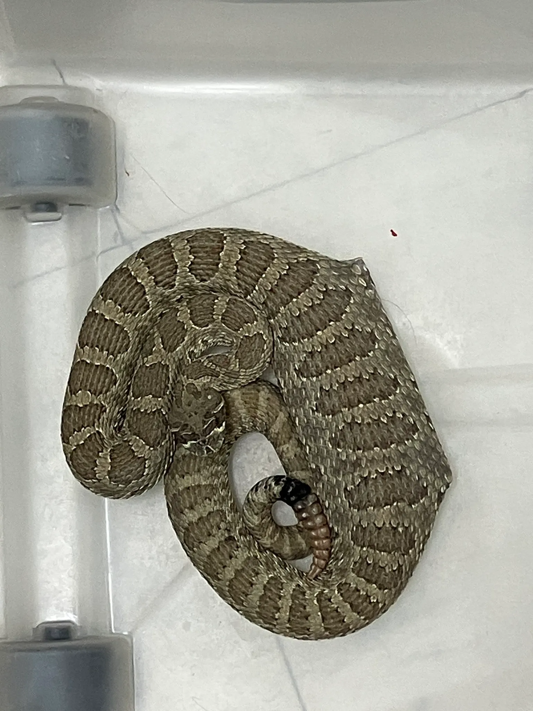

Moving data in the cloud
================
Ty Tuff, ESIIL Data Scientist
2023-10-30

# Solving Environmental Data Challenges with Cloud Computing

In the realm of environmental data science, the vast and ever-expanding
datasets can present significant challenges, akin to ecological
metaphors that illustrate the struggle between data size and processing
capabilities. Let’s explore these challenges and their innovative cloud
computing solutions.

## 1) The Rat through the Snake Problem: Scalability with Cloud Computing

Just like a snake that swallows a rat, traditional computing systems
often struggle to process the large volumes of environmental data —
they’re constrained by their static hardware limitations. Cloud
computing introduces a python-esque capability: massive scalability. By
migrating to the cloud, we essentially make the snake bigger, allowing
it to handle larger “prey.” Scalable computers in the cloud can grow
with the demand, providing the necessary computational power to process
extensive datasets, which is vital in a field where data volumes are
increasing exponentially.

## 2) The Antelope through the Python Problem: Streamlining with GDAL VSI

As we scale up, we encounter a new challenge: trying to pass an antelope
through a python — a metaphor for the next level of complexity in data
processing. The sheer size and complexity of the data can become
overwhelming. This is where GDAL’s Virtual File System (VSI) becomes our
ecological adaptation. VSI allows us to access remote data transparently
and more efficiently. Instead of ingesting the entire “antelope,” VSI
enables the “python” to dynamically access and process only the parts of
the data it needs, when it needs them, much like constriction before
digestion. This selective access minimizes the need for local storage
and expedites the data handling process.

## 3) Drinking from a Fire Hose: Accelerated Inference with AI and ML

Once we’ve enabled the flow of large amounts of digestible data, we
encounter the metaphorical challenge of drinking from a fire hose. The
data, now flowing and accessible, is immense and rapid — posing a
challenge not just to store and process, but to understand and derive
meaning from in real-time. This is where artificial intelligence (AI)
and machine learning (ML) step in. These technologies act as a
sophisticated filtration system, enabling us to drink safely and
beneficially from the torrent. AI and ML can analyze patterns, make
predictions, and infer insights at a pace that keeps up with the fast
stream of data, turning raw information into actionable knowledge.

By addressing these three pivotal challenges with cloud computing, GDAL
VSI, and AI/ML, we not only manage to consume the data effectively but
also transform our capabilities in environmental data science. We can
move from mere data ingestion to meaningful data interpretation, all at
a scale and speed necessary for impactful environmental analysis.
