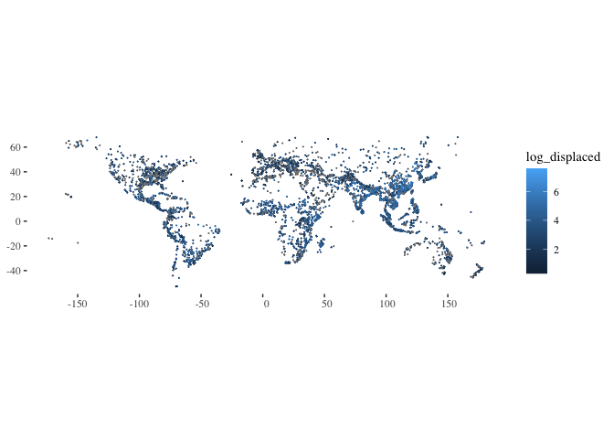
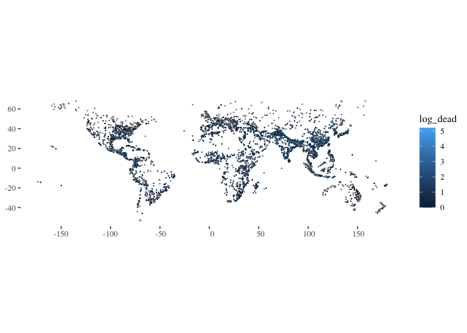
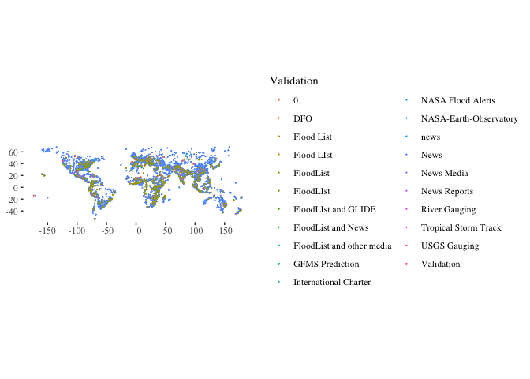
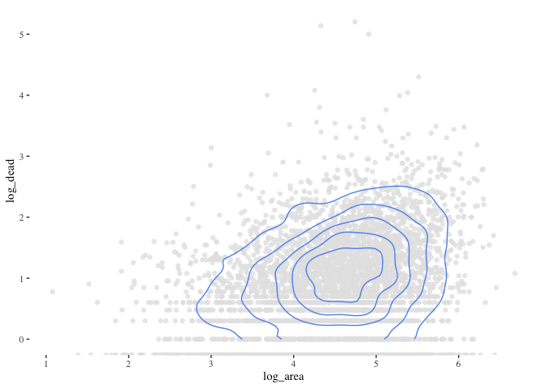
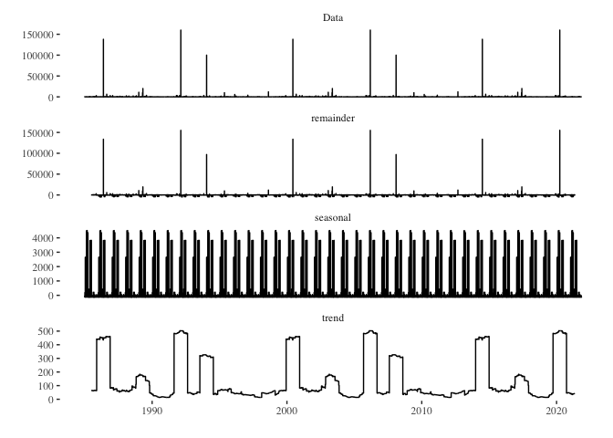
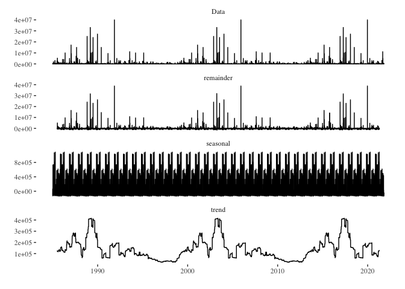
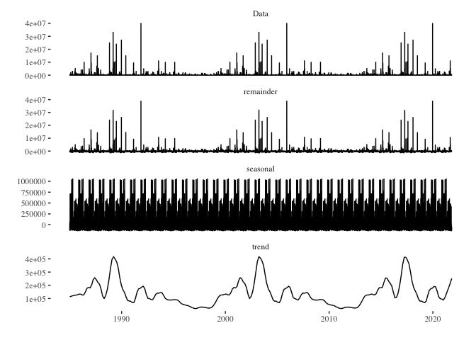
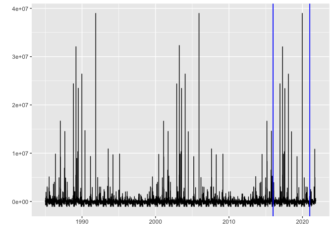
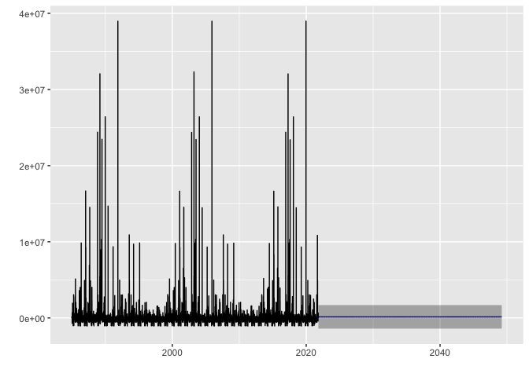

Pull flood data
================
Ty Tuff, ESIIL Data Scientist
2023-10-27

[Global Active Archive of Large Flood Events,
1985-Present](https://floodobservatory.colorado.edu/Archives/index.html)

Housed at the Dartmouth Flood Observatory (DFO) and maintained by the
University of Colorado, the Global Active Archive of Large Flood Events
is a comprehensive repository that records significant flood events from
1985 to the present day. This dynamic and “active” archive continually
incorporates data from contemporary flood events, ensuring the
information remains current and relevant.

Key Features:

-   Diverse Data Sources: The information within the archive is
    meticulously collated from a wide array of sources, including news
    reports, governmental agencies, instrumental measurements, and
    satellite remote sensing.

-   Granular Event Details: Each recorded flood event within the archive
    is distinct, and its associated details are presented in an “area
    affected” map. Despite the discrete nature of these records, it’s
    acknowledged that certain regions experience recurrent flooding,
    which may necessitate a nuanced approach in classifying such events.

-   Comprehensive Coverage: The archive boasts a global purview,
    capturing the magnitude and impact of significant flood events
    worldwide. It’s noteworthy that while death and displacement
    estimates from tropical storms encompass all causative factors,
    storms devoid of notable river flooding aren’t incorporated.

-   Accessible Formats: The archive is versatile in its presentation:

    -   An online table enumerates recent flood events.
    -   Detailed records from 1985 onwards are accessible in both Excel
        (.xlsx and .xml) formats. These are periodically updated.
    -   GIS users can tap into zip-compressed MapInfo and Shp format
        files that elucidate flood catalog numbers, centroids, and other
        salient attribute details.

-   Satellite Imaging: A considerable number of flood events have been
    vividly captured through satellite imaging. These have been further
    processed by the DFO to generate detailed maps delineating
    inundation extents. An index of these maps is accessible via the DFO
    Flood Maps Index.

    -   For those interested in understanding the methodology behind the
        creation of these invaluable maps and tables, additional notes
        and insights are available within the archive.

The Global Active Archive, given its academic and research-oriented
nature, is generously made available at no charge for scholarly pursuits
and educational endeavors.

Sample Citation: G.R. Brakenridge. Global Active Archive of Large Flood
Events. Dartmouth Flood Observatory, University of Colorado, USA.

[Flood data file types available for
download](/Users/ty/Documents/Github/hackathon2023_datacube/code_for_building_cube/file_types_for_flood_data.png)

[Here is arial imagery for some
floods](https://floodobservatory.colorado.edu/FloodMapIndex.htm)

# Load Libraries

The code chunk provided is written in R and is used for loading multiple
libraries/packages. These libraries contain functions and tools that
extend the capabilities of R for various tasks. Specifically:

glue: Provides tools to format R strings with embedded code. sf: Used
for handling and analyzing spatial data. terra: Offers tools for spatial
data handling and analysis. ggplot2: A popular data visualization
package in R. dplyr: Part of the tidyverse and is used for data
manipulation. ggthemes: Adds extra themes, geoms, and scales to ggplot2.
forecast: Used for time series forecasting.

When executed, this code will make the functions and tools from these
libraries available for use in the R session.

``` r
library(glue)
library(sf)
```

    Linking to GEOS 3.11.0, GDAL 3.5.3, PROJ 9.1.0; sf_use_s2() is TRUE

``` r
library(terra)
```

    terra 1.7.39


    Attaching package: 'terra'

    The following object is masked from 'package:glue':

        trim

``` r
library(ggplot2)
library(dplyr)
```


    Attaching package: 'dplyr'

    The following objects are masked from 'package:terra':

        intersect, union

    The following objects are masked from 'package:stats':

        filter, lag

    The following objects are masked from 'package:base':

        intersect, setdiff, setequal, union

``` r
library(ggthemes)
library(forecast)
```

    Registered S3 method overwritten by 'quantmod':
      method            from
      as.zoo.data.frame zoo 

``` r
library(lubridate)
```


    Attaching package: 'lubridate'

    The following objects are masked from 'package:terra':

        intersect, union

    The following objects are masked from 'package:base':

        date, intersect, setdiff, union

``` r
library(ggfortify)
```

    Registered S3 methods overwritten by 'ggfortify':
      method                 from    
      autoplot.Arima         forecast
      autoplot.acf           forecast
      autoplot.ar            forecast
      autoplot.bats          forecast
      autoplot.decomposed.ts forecast
      autoplot.ets           forecast
      autoplot.forecast      forecast
      autoplot.stl           forecast
      autoplot.ts            forecast
      fitted.ar              forecast
      fortify.ts             forecast
      residuals.ar           forecast

``` r
library(changepoint)
```

    Loading required package: zoo


    Attaching package: 'zoo'

    The following object is masked from 'package:terra':

        time<-

    The following objects are masked from 'package:base':

        as.Date, as.Date.numeric

    Successfully loaded changepoint package version 2.2.4
     See NEWS for details of changes.

# [Connect to api](https://floodobservatory.colorado.edu/temp/)

The R code provided is designed to retrieve and preprocess flood data
from a public API. Here’s a step-by-step breakdown:

-   Using the glue function, a URL is created that points to an Excel
    file (FloodArchive.xlsx) hosted on the Flood Observatory website.
-   vect() reads this URL, which is effectively an Excel file, treating
    it as a spatial vector.
-   as.data.frame() is used to convert the spatial vector to a
    dataframe.
-   st_as_sf() converts the dataframe to a spatial dataframe with
    longitude and latitude coordinates.
-   The following mutate() functions are utilized: Convert the ‘Began’
    and ‘Ended’ columns into POSIXct date-time format.
-   Convert ‘Validation’ and ‘MainCause’ columns into factors.
-   Compute the logarithm (base 10) of the ‘Dead’ and ‘Displaced’
    columns and store them as ‘log_dead’ and ‘log_displaced’,
    respectively.
-   Finally, the select() function keeps only specific columns from the
    dataframe, providing a cleaner, more focused dataset.

After processing, the flood_point_data dataframe is displayed, showing
the cleaned and transformed flood data.

``` r
# Connect to API: https://floodobservatory.colorado.edu/temp/

flood_point_data <- glue("/vsicurl/https://floodobservatory.colorado.edu/temp/FloodArchive.xlsx") %>%
  vect() %>%
  as.data.frame() %>%
  st_as_sf(coords = c("long","lat")) %>%
  mutate(Began = as.POSIXct(strptime(Began, format="%y/%m/%d"))) %>%
  mutate(Ended = as.POSIXct(strptime(Ended, format="%y/%m/%d"))) %>%
  mutate(Validation = as.factor(Validation)) %>%
  mutate(MainCause = as.factor(MainCause)) %>%
  mutate(log_dead = log10(Dead)) %>%
  mutate(log_displaced = log10(Displaced)) %>%
  mutate(log_area = log10(Area)) %>%
  select(Began, Ended, ID, GlideNumber, Country,   
         OtherCountry, Area, Validation, Dead, Displaced,   
         MainCause, Severity, log_dead, log_displaced,log_area, geometry)

flood_point_data
```

    Simple feature collection with 5130 features and 15 fields
    Geometry type: POINT
    Dimension:     XY
    Bounding box:  xmin: -173.454 ymin: -52.9076 xmax: 179.651 ymax: 68.1591
    CRS:           NA
    First 10 features:
       Began Ended ID GlideNumber         Country OtherCountry      Area Validation
    1   <NA>  <NA>  1           0         Algeria            0  92615.67       News
    2   <NA>  <NA>  2           0          Brazil            0 678498.82       News
    3   <NA>  <NA>  3           0     Phillipines            0  12846.03       News
    4   <NA>  <NA>  4           0       Indonesia            0  16542.12       News
    5   <NA>  <NA>  5           0      Mozambique            0  20082.21       News
    6   <NA>  <NA>  6           0 Comoros islands            0   1035.61       News
    7   <NA>  <NA>  7           0     New Zealand            0   7871.37       News
    8   <NA>  <NA>  8           0       Indonesia            0  77091.11       News
    9   <NA>  <NA>  9           0             USA            0 210527.96       News
    10  <NA>  <NA> 10           0         Bolivia            0  69706.89       News
       Dead Displaced         MainCause Severity log_dead log_displaced log_area
    1    26      3000        Heavy rain        1 1.414973      3.477121 4.966684
    2   229     80000        Heavy rain        2 2.359835      4.903090 5.831549
    3    43       444   Torrential rain        1 1.633468      2.647383 4.108769
    4    21       300   Torrential rain        1 1.322219      2.477121 4.218591
    5    19         0        Heavy rain        2 1.278754          -Inf 4.302812
    6     2     35000  Tropical cyclone        1 0.301030      4.544068 3.015196
    7     4       200        Heavy rain        1 0.602060      2.301030 3.896050
    8    10      2000        Heavy rain        1 1.000000      3.301030 4.887004
    9     7      2250 Rain and snowmelt        2 0.845098      3.352183 5.323310
    10    2      1000        Heavy Rain        1 0.301030      3.000000 4.843276
                        geometry
    1    POINT (5.23026 35.8142)
    2  POINT (-45.3489 -18.7111)
    3    POINT (122.974 10.0207)
    4    POINT (124.606 1.01489)
    5   POINT (32.3491 -25.8693)
    6     POINT (43.36 -11.6516)
    7   POINT (175.734 -37.2305)
    8    POINT (108.14 -7.04008)
    9   POINT (-85.1742 40.6691)
    10 POINT (-63.2887 -21.2244)

``` r
ggplot(data=flood_point_data, aes(color=Severity)) +
  geom_sf(cex=0.01) + 
  theme_tufte()
```


-   ggplot(data=flood_point_data, aes(color=Severity)): This initializes
    a ggplot object using the flood_point_data dataframe. It also sets
    the aesthetic color based on the ‘Severity’ column. This means that
    different severities will be represented by different colors.
-   geom_sf(size=0.01): Adds spatial data points to the plot. The
    size=0.01 argument reduces the size of these points, making them
    small dots on the plot. The original code used cex=0.01, which isn’t
    a valid argument for geom_sf in ggplot2. Instead, the correct
    argument to control the size of the points is size.

The resulting plot would visualize the spatial distribution of flood
points, with colors indicating the severity of each flood. Adjusting the
size parameter can make the dots larger or smaller based on preference.

``` r
ggplot(data=flood_point_data, aes(color=MainCause))  +geom_sf(cex=0.01) + 
  theme_tufte()
```


``` r
ggplot(data=flood_point_data, aes(color=log_displaced))  +geom_sf(cex=0.01) + 
  theme_tufte()
```



``` r
ggplot(data=flood_point_data, aes(color=log_dead))  +geom_sf(cex=0.01) + 
  theme_tufte()
```



``` r
ggplot(data=flood_point_data, aes(color=Validation))  +geom_sf(cex=0.01) + 
  theme_tufte()
```



``` r
ggplot(data=flood_point_data, aes(color=Began))+ geom_sf(cex=0.01) + 
  theme_tufte()
```

``` r
ggplot(data=flood_point_data, aes(color=Area))  +
  geom_sf(cex=0.01) + 
  theme_tufte()
```


``` r
ggplot(data=flood_point_data)  +
  geom_point(aes(x=Began ,y=log_dead), color="grey90", alpha=0.8) +
  geom_density_2d(aes(x=Began ,y=log_dead), color="cornflowerblue") + 
  theme_tufte()
```

-   ggplot(data=flood_point_data): Initializes a ggplot object using the
    flood_point_data dataframe.
-   geom_point(aes(x=Began ,y=log_dead), color=“grey90”, alpha=0.8):
    Adds scatter plot points to the ggplot object, with the x-axis
    representing the date the flood began (Began) and the y-axis
    representing the logarithm of the death toll (log_dead). The points
    are colored light gray (grey90) with a transparency of 0.8, making
    them slightly see-through.
-   geom_density_2d(aes(x=Began ,y=log_dead), color=“cornflowerblue”):
    This adds a 2D density estimation to the plot. The density
    estimation essentially provides a visual representation of where
    most of the data points cluster, helping identify patterns in the
    scatter plot. The density lines are colored cornflower blue.
-   theme_tufte(): Applies the Tufte theme to the plot, which is a
    minimalist theme based on the design principles of Edward Tufte, a
    pioneer in the field of data visualization. This theme helps reduce
    non-data ink, thereby enhancing the clarity of the visualization.

The resulting plot would visually represent the relationship between the
date floods started and the logarithm of the associated death toll, with
additional visual cues indicating areas of high density (many events
with similar characteristics).

``` r
ggplot(data=flood_point_data)  +
  geom_point(aes(x=Began ,y=log_displaced), color="grey90", alpha=0.8)+
  geom_density_2d(aes(x=Began ,y=log_displaced), color="cornflowerblue") + 
  theme_tufte()
```

``` r
ggplot(data=flood_point_data)  +
  geom_point(aes(x=log_dead ,y=log_displaced), color="grey90", alpha=0.8)+
  geom_density_2d(aes(x=log_dead ,y=log_displaced), color="cornflowerblue") + 
  theme_tufte()
```

    Warning: Removed 2526 rows containing non-finite values (`stat_density2d()`).


``` r
ggplot(data=flood_point_data)  +
  geom_point(aes(x=log_area ,y=log_displaced), color="grey90", alpha=0.8)+
  geom_density_2d(aes(x=log_area ,y=log_displaced), color="cornflowerblue") + 
  theme_tufte()
```

    Warning: Removed 1525 rows containing non-finite values (`stat_density2d()`).


``` r
ggplot(data=flood_point_data)  +
  geom_point(aes(x=log_area ,y=log_dead), color="grey90", alpha=0.8)+
  geom_density_2d(aes(x=log_area ,y=log_dead), color="cornflowerblue") + 
  theme_tufte()
```

    Warning: Removed 1554 rows containing non-finite values (`stat_density2d()`).



``` r
ggplot(data=flood_point_data)  +
  geom_point(aes(x=Severity ,y=log_displaced), color="grey90", alpha=0.8)+
  geom_density_2d(aes(x=Severity ,y=log_displaced), color="cornflowerblue") + 
  theme_tufte()
```

    Warning: Removed 1525 rows containing non-finite values (`stat_density2d()`).


``` r
ggplot(data=flood_point_data)  +
  geom_point(aes(x=Severity ,y=log_dead), color="grey90", alpha=0.8)+
  geom_density_2d(aes(x=Severity ,y=log_dead), color="cornflowerblue") + 
  theme_tufte()
```

    Warning: Removed 1554 rows containing non-finite values (`stat_density2d()`).


``` r
head(flood_point_data)
```

    Simple feature collection with 6 features and 15 fields
    Geometry type: POINT
    Dimension:     XY
    Bounding box:  xmin: -45.3489 ymin: -25.8693 xmax: 124.606 ymax: 35.8142
    CRS:           NA
      Began Ended ID GlideNumber         Country OtherCountry      Area Validation
    1  <NA>  <NA>  1           0         Algeria            0  92615.67       News
    2  <NA>  <NA>  2           0          Brazil            0 678498.82       News
    3  <NA>  <NA>  3           0     Phillipines            0  12846.03       News
    4  <NA>  <NA>  4           0       Indonesia            0  16542.12       News
    5  <NA>  <NA>  5           0      Mozambique            0  20082.21       News
    6  <NA>  <NA>  6           0 Comoros islands            0   1035.61       News
      Dead Displaced        MainCause Severity log_dead log_displaced log_area
    1   26      3000       Heavy rain        1 1.414973      3.477121 4.966684
    2  229     80000       Heavy rain        2 2.359835      4.903090 5.831549
    3   43       444  Torrential rain        1 1.633468      2.647383 4.108769
    4   21       300  Torrential rain        1 1.322219      2.477121 4.218591
    5   19         0       Heavy rain        2 1.278754          -Inf 4.302812
    6    2     35000 Tropical cyclone        1 0.301030      4.544068 3.015196
                       geometry
    1   POINT (5.23026 35.8142)
    2 POINT (-45.3489 -18.7111)
    3   POINT (122.974 10.0207)
    4   POINT (124.606 1.01489)
    5  POINT (32.3491 -25.8693)
    6    POINT (43.36 -11.6516)

``` r
non_spatial_version_data <- as.data.frame(flood_point_data)
first_date <- min(non_spatial_version_data[,1])
last_date <- max(non_spatial_version_data[,1])
```

-   non_spatial_version_data \<- as.data.frame(flood_point_data): The
    spatial data flood_point_data is converted to a regular non-spatial
    dataframe, and stored in the variable non_spatial_version_data.
-   first_date \<- min(non_spatial_version_data\[,1\]): It’s assumed
    that the first column of non_spatial_version_data contains the date
    data. The minimum date (earliest date) in this column is identified
    and stored in the variable first_date.
-   last_date \<- max(non_spatial_version_data\[,1\]): Similarly, the
    maximum date (most recent date) in the first column is identified
    and stored in the variable last_date.

This code effectively extracts the range of dates present in the
flood_point_data. However, a more robust approach might be to use column
names rather than column indices for clarity and to avoid potential
errors if the structure of the dataframe changes in the future.

# Death time series

``` r
death_series <- ts(st_drop_geometry(flood_point_data$Dead), frequency = 365, start = c(1985, 1), end = c(2021,311))
head(death_series)
```

    Time Series:
    Start = c(1985, 1) 
    End = c(1985, 6) 
    Frequency = 365 
    [1]  26 229  43  21  19   2

-   st_drop_geometry(flood_point_data\[,9\]): Before creating the time
    series, you’re using the st_drop_geometry function from the sf
    package to drop spatial information from the data. You’re then
    selecting the 9th column, which presumably contains death data
    (based on our prior discussions). However, it would be more robust
    to reference the column by name instead of its index to ensure the
    correct data is being selected.
-   ts(…, frequency = 365, start = c(1985, 1), end = c(2021,300)): This
    initializes a time series (ts) object. The frequency argument is set
    to 365, suggesting that the data is daily. The start argument
    specifies that the series begins in January 1985. The end argument,
    however, seems to have an oversight; the day value of 300 is out of
    range for typical calendar days. Perhaps you meant to represent the
    300th day of 2021, but typically, the ts function expects the format
    c(year, frequency_value), with the frequency value not exceeding the
    specified frequency (in this case, 365).
-   death_series: Displays the created time series object.

``` r
death_series %>%
  decompose() %>%
  autoplot() + theme_tufte()
```



-   death_series %\>% decompose(): The decompose() function from the
    base R stats package breaks a time series into its component parts:
    trend, seasonal, and random (also called “remainder” or “error”).
    This allows for a clearer understanding of the underlying patterns
    in the data.
-   autoplot(): This function from the forecast package provides
    automatic ggplot2-based visualization of time series objects. When
    used on the output of decompose(), it generates a multipanel plot
    showing the observed, trend, seasonal, and remainder components of
    the time series.
-   theme_tufte(): This adds the Tufte theme (from the ggthemes package)
    to the plot. As previously mentioned, Edward Tufte’s design
    principles prioritize clarity and minimalism, and this theme helps
    enhance the readability of the plot by reducing non-data ink.

``` r
death_series %>%
 stl(s.window = "periodic") %>%
  autoplot() + theme_tufte()
```


-   death_series %\>% stl(s.window = “periodic”): The stl() function
    decomposes the time series using LOESS. It’s a more flexible method
    compared to the traditional decompose() function, especially when
    dealing with non-linear trends or changing seasonal patterns. The
    s.window = “periodic” argument indicates that the seasonal component
    should be treated as periodic, implying a stable seasonal pattern
    throughout the series.
-   autoplot(): Again, this function from the forecast package provides
    an automatic ggplot2-based visualization of time series objects.
    When applied to the output of stl(), it creates a multipanel plot
    displaying the observed series, trend component, seasonal component,
    and remainder (sometimes termed “noise” or “error”).
-   theme_tufte(): This overlays the Tufte theme on the plot, providing
    a minimalist design that emphasizes the data. In essence, this code
    decomposes the death_series time series using the STL method and
    visualizes the observed series, its trend, its seasonal patterns,
    and the remainder, all presented in a clear and minimalist style
    courtesy of the theme_tufte(). This visualization can be immensely
    valuable in understanding underlying patterns and variations within
    time series data.

``` r
seasonally_adjusted_log_dead <- death_series %>% stl(s.window='periodic') %>% seasadj() 
```

``` r
death_series %>%
 stl(s.window = "periodic") %>%
  autoplot() + theme_tufte()
```


``` r
arima_max_temp <- auto.arima(seasonally_adjusted_log_dead)
arima_max_temp
```

    Series: seasonally_adjusted_log_dead 
    ARIMA(0,0,0) with non-zero mean 

    Coefficients:
              mean
          139.4731
    s.e.   29.0378

    sigma^2 = 11343057:  log likelihood = -128335.4
    AIC=256674.9   AICc=256674.9   BIC=256689.9

``` r
autoplot(cpt.meanvar(seasonally_adjusted_log_dead), cpt.colour = 'blue', cpt.linetype = 'solid')
```


``` r
arima_max_temp %>% forecast(h=10000) %>% autoplot()
```


# Displaced time series

``` r
death_series <- ts(st_drop_geometry(flood_point_data$Displaced), frequency = 365, start = c(1985, 1), end = c(2021,300))
head(death_series)
```

    Time Series:
    Start = c(1985, 1) 
    End = c(1985, 6) 
    Frequency = 365 
    [1]  3000 80000   444   300     0 35000

-   st_drop_geometry(flood_point_data\[,9\]): Before creating the time
    series, you’re using the st_drop_geometry function from the sf
    package to drop spatial information from the data. You’re then
    selecting the 9th column, which presumably contains death data
    (based on our prior discussions). However, it would be more robust
    to reference the column by name instead of its index to ensure the
    correct data is being selected.
-   ts(…, frequency = 365, start = c(1985, 1), end = c(2021,300)): This
    initializes a time series (ts) object. The frequency argument is set
    to 365, suggesting that the data is daily. The start argument
    specifies that the series begins in January 1985. The end argument,
    however, seems to have an oversight; the day value of 300 is out of
    range for typical calendar days. Perhaps you meant to represent the
    300th day of 2021, but typically, the ts function expects the format
    c(year, frequency_value), with the frequency value not exceeding the
    specified frequency (in this case, 365).
-   death_series: Displays the created time series object.

``` r
death_series %>%
  decompose() %>%
  autoplot() + theme_tufte()
```



-   death_series %\>% decompose(): The decompose() function from the
    base R stats package breaks a time series into its component parts:
    trend, seasonal, and random (also called “remainder” or “error”).
    This allows for a clearer understanding of the underlying patterns
    in the data.
-   autoplot(): This function from the forecast package provides
    automatic ggplot2-based visualization of time series objects. When
    used on the output of decompose(), it generates a multipanel plot
    showing the observed, trend, seasonal, and remainder components of
    the time series.
-   theme_tufte(): This adds the Tufte theme (from the ggthemes package)
    to the plot. As previously mentioned, Edward Tufte’s design
    principles prioritize clarity and minimalism, and this theme helps
    enhance the readability of the plot by reducing non-data ink.

``` r
death_series %>%
 stl(s.window = "periodic") %>%
  autoplot() + theme_tufte()
```



-   death_series %\>% stl(s.window = “periodic”): The stl() function
    decomposes the time series using LOESS. It’s a more flexible method
    compared to the traditional decompose() function, especially when
    dealing with non-linear trends or changing seasonal patterns. The
    s.window = “periodic” argument indicates that the seasonal component
    should be treated as periodic, implying a stable seasonal pattern
    throughout the series.
-   autoplot(): Again, this function from the forecast package provides
    an automatic ggplot2-based visualization of time series objects.
    When applied to the output of stl(), it creates a multipanel plot
    displaying the observed series, trend component, seasonal component,
    and remainder (sometimes termed “noise” or “error”).
-   theme_tufte(): This overlays the Tufte theme on the plot, providing
    a minimalist design that emphasizes the data. In essence, this code
    decomposes the death_series time series using the STL method and
    visualizes the observed series, its trend, its seasonal patterns,
    and the remainder, all presented in a clear and minimalist style
    courtesy of the theme_tufte(). This visualization can be immensely
    valuable in understanding underlying patterns and variations within
    time series data.

``` r
seasonally_adjusted_log_dead <- death_series %>% stl(s.window='periodic') %>% seasadj() 
```

``` r
death_series %>%
 stl(s.window = "periodic") %>%
  autoplot() + theme_tufte()
```


``` r
arima_max_temp <- auto.arima(seasonally_adjusted_log_dead)
arima_max_temp
```

    Series: seasonally_adjusted_log_dead 
    ARIMA(0,0,0) with non-zero mean 

    Coefficients:
               mean
          139494.46
    s.e.   10570.21

    sigma^2 = 1.455e+12:  log likelihood = -207268.4
    AIC=414540.7   AICc=414540.7   BIC=414555.7

``` r
autoplot(cpt.meanvar(seasonally_adjusted_log_dead), cpt.colour = 'blue', cpt.linetype = 'solid')
```



``` r
arima_max_temp %>% forecast(h=10000) %>% autoplot()
```


