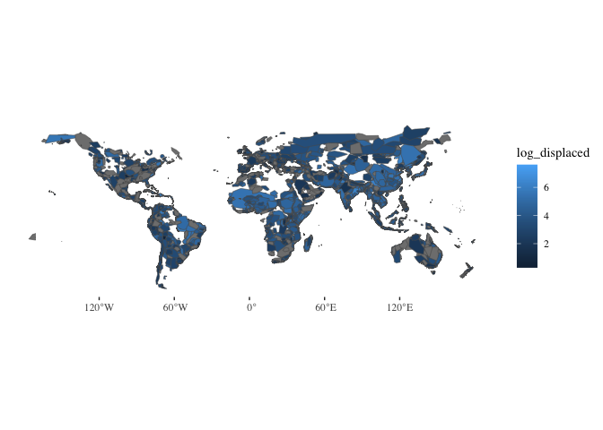
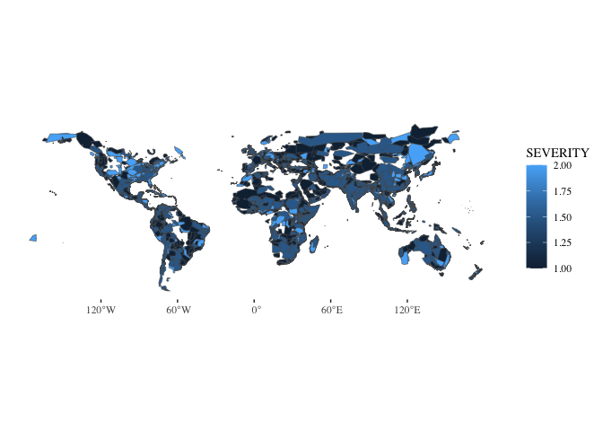

Pull flood polygons
================

``` r
library(dplyr)
```


    Attaching package: 'dplyr'

    The following objects are masked from 'package:stats':

        filter, lag

    The following objects are masked from 'package:base':

        intersect, setdiff, setequal, union

``` r
library(sf)
```

    Linking to GEOS 3.11.0, GDAL 3.5.3, PROJ 9.1.0; sf_use_s2() is TRUE

``` r
library(terra)
```

    terra 1.7.39

``` r
library(glue)
```


    Attaching package: 'glue'

    The following object is masked from 'package:terra':

        trim

``` r
library(ggplot2)
library(ggthemes)
```

``` r
# Connect to API: https://floodobservatory.colorado.edu/temp/FloodArchive_region.shp

flood_polygon_data <- glue("/vsicurl/https://floodobservatory.colorado.edu/temp/FloodArchive_region.shp") %>%
  vect() %>%
  st_as_sf(coords = c("long","lat")) %>%
  mutate(BEGAN = as.POSIXct(strptime(BEGAN, format="%y/%m/%d"))) %>%
  mutate(ENDED = as.POSIXct(strptime(ENDED, format="%y/%m/%d"))) %>%
  mutate(VALIDATION = as.factor(VALIDATION)) %>%
  mutate(MAINCAUSE = as.factor(MAINCAUSE)) %>%
  mutate(log_dead = log10(DEAD)) %>%
  mutate(log_displaced = log10(DISPLACED)) %>%
  mutate(log_area = log10(AREA)) #%>%
  #select(Began, Ended, ID, GlideNumber, Country,   
  #        OtherCountry, Area, Validation, Dead, Displaced,   
  #        MainCause, Severity, log_dead, log_displaced,log_area, geometry)

flood_polygon_data
```

    Simple feature collection with 5131 features and 17 fields
    Geometry type: GEOMETRY
    Dimension:     XY
    Bounding box:  xmin: -176.1486 ymin: -54.85077 xmax: 179.9823 ymax: 74.00105
    Geodetic CRS:  MapInfo Generic Lat/Long
    First 10 features:
       ID GLIDENUMBE         COUNTRY OTHERCOUNT       LONG        LAT       AREA
    1   1          0         Algeria          0   5.230257  35.814242  92615.668
    2   2          0          Brazil          0 -45.348871 -18.711052 678498.821
    3   3          0     Phillipines          0 122.974280  10.020719  12846.028
    4   4          0       Indonesia          0 124.606276   1.014892  16542.125
    5   5          0      Mozambique          0  32.349078 -25.869263  20082.211
    6   6          0 Comoros islands          0  43.359976 -11.651576   1035.608
    7   7          0     New Zealand          0 175.734165 -37.230452   7871.367
    8   8          0       Indonesia          0 108.139505  -7.040083  77091.115
    9   9          0             USA          0 -85.174239  40.669067 210527.956
    10 10          0         Bolivia          0 -63.288713 -21.224368  69706.892
       BEGAN ENDED VALIDATION DEAD DISPLACED         MAINCAUSE SEVERITY
    1   <NA>  <NA>       News   26      3000        Heavy rain        1
    2   <NA>  <NA>       News  229     80000        Heavy rain        2
    3   <NA>  <NA>       News   43       444   Torrential rain        1
    4   <NA>  <NA>       News   21       300   Torrential rain        1
    5   <NA>  <NA>       News   19         0        Heavy rain        2
    6   <NA>  <NA>       News    2     35000  Tropical cyclone        1
    7   <NA>  <NA>       News    4       200        Heavy rain        1
    8   <NA>  <NA>       News   10      2000        Heavy rain        1
    9   <NA>  <NA>       News    7      2250 Rain and snowmelt        2
    10  <NA>  <NA>       News    2      1000        Heavy Rain        1
                             geometry log_dead log_displaced log_area
    1  POLYGON ((1.994201 36.55729... 1.414973      3.477121 4.966684
    2  POLYGON ((-41.42766 -15.441... 2.359835      4.903090 5.831549
    3  POLYGON ((123.3318 10.33395... 1.633468      2.647383 4.108769
    4  POLYGON ((124.0085 0.36953,... 1.322219      2.477121 4.218591
    5  POLYGON ((32.0195 -24.85583... 1.278754          -Inf 4.302812
    6  POLYGON ((43.29787 -11.8572... 0.301030      4.544068 3.015195
    7  POLYGON ((176.4058 -37.7460... 0.602060      2.301030 3.896050
    8  POLYGON ((111.0781 -6.57599... 1.000000      3.301030 4.887004
    9  MULTIPOLYGON (((-88.63389 4... 0.845098      3.352183 5.323310
    10 POLYGON ((-61.74586 -19.635... 0.301030      3.000000 4.843276

``` r
ggplot(data=flood_polygon_data, aes(fill=log_displaced)) +
  geom_sf() + 
  theme_tufte()
```



``` r
ggplot(data=flood_polygon_data, aes(fill=SEVERITY)) +
  geom_sf() + 
  theme_tufte()
```


