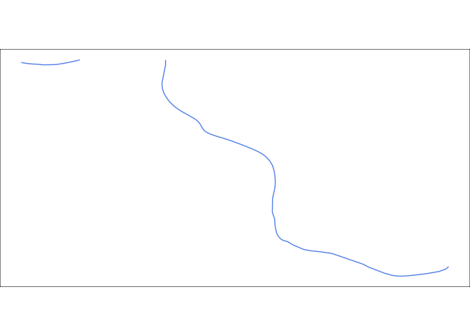
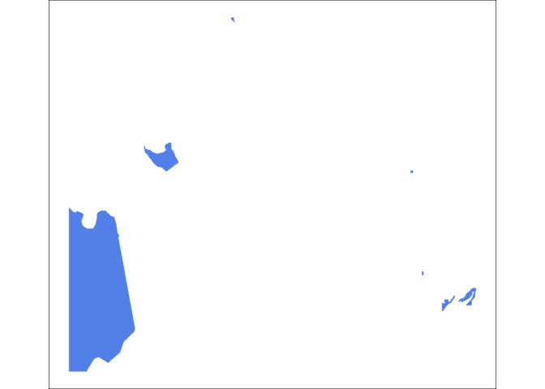

Pull river vector data
================
Ty Tuff, ESIIL Data Scientist
2023-10-27

``` r
library(sf)
```

    Linking to GEOS 3.11.0, GDAL 3.5.3, PROJ 9.1.0; sf_use_s2() is TRUE

``` r
library(ggplot2)
library(osmdata)
```

    Data (c) OpenStreetMap contributors, ODbL 1.0. https://www.openstreetmap.org/copyright

``` r
library(osmextract)
```

    Data (c) OpenStreetMap contributors, ODbL 1.0. https://www.openstreetmap.org/copyright.
    Check the package website, https://docs.ropensci.org/osmextract/, for more details.

``` r
library(dplyr)
```


    Attaching package: 'dplyr'

    The following objects are masked from 'package:stats':

        filter, lag

    The following objects are masked from 'package:base':

        intersect, setdiff, setequal, union

``` r
our_blue <- "cornflowerblue"
our_yellow <- "#FFD60F"
our_beige <- "#EDEDF0"
our_purple <- "white"
```

3.  Download water features. The water features are first divided into
    moving and stationary water. We will download the river layer from
    the waterway key.

``` r
water <- oe_get(
  place = "Lawrence, Kansas", 
  layer = "lines",
  query = "SELECT * FROM lines WHERE waterway IN ('river')",
  quiet = TRUE
)
```

``` r
bb <- getbb("Lawrence, Kansas")
bb
```

            min       max
    x -95.34454 -95.16662
    y  38.90447  39.03350

We divide the water into large and small waterways in the same way we
did with the road. We are interested in making the main river much
larger and the remaining waterways collectively smaller. The Kansas
river is the large feature in this map so, we pull it out first.

``` r
Kansas_river_multi <- water |>
  filter(name == "Kansas River")  |> 
  st_as_sf() |>
  st_crop(y = c(ymin = bb[2,1], ymax = bb[2,2], xmin = bb[1,1], xmax = bb[1,2]))
```



After removing the Kansas river, we are left with a number of remaining
waterways that are stored as both linestrings and multilinestrings. We
need to download each of those data types individually.

``` r
small_water_lines <- water |>
  filter(name != "Kansas River")|>
  st_as_sf() |>
  st_crop(y = c(ymin = bb[2,1], ymax = bb[2,2], xmin = bb[1,1], xmax = bb[1,2]))
```


The stationary water bodies are a subcategory under the key=natural and
the value=water. We ask for the extra column named water to be include
in our returned sf table. We can use that column to filter our the lakes
and reservours as local water bodies.

``` r
# Request all water features using natural:water but also request the water tag be given it's own column. 
water_body <- oe_get(
  place = "Lawrence, Kansas", 
  layer = "multipolygons",
  query = "SELECT * FROM multipolygons WHERE natural IN ('water')",
  quiet = TRUE,
  extra_tags = c("water") #give water it's own column instead of clumping in supplimentary list
)

water_body_crop <- water_body %>%
  filter(water == 'lake' | water == "reservoir") %>%
  st_as_sf() %>%
  st_make_valid()%>%
  st_crop(y = c(ymin = bb[2,1], ymax = bb[2,2], xmin = bb[1,1], xmax = bb[1,2]))
```



### Stack downloaded OSM layers into a final basemap.

This is a special edit to manually shift the bounding box so that it
better centered Haskell University in the basemap. Most people will not
need this adjustment but may enjoy the ability to microadjust their
basemap.

``` r
bbb <- bb
bbb[1,1] <- bbb[1,1] - 0.001
bbb[1,2] <- bbb[1,2] + 0.001
bbb[2,1] <- bbb[2,1] - 0.03
bbb[2,2] <- bbb[2,2] + 0.001
xlimit <- bbb[1,]
ylimit <- bbb[2,] 
xmid <- xlimit[1] + diff(xlimit) / 2 
ratio <- diff(xlimit) / diff(ylimit)
```

This is a long plot that calls each of the plot layers in order from the
back to the front. There is a section at the end that crop, format, and
append the basemap.

``` r
waterway_map <- ggplot() +
  # plot moving water layers first
  geom_sf(data = Kansas_river_multi, alpha = .8,
          linewidth = 30, colour = "black") +
  geom_sf(data = small_water_lines, alpha = .8,
          linewidth = 5, colour = "black") +
  # Layer bodies of water over the moving water layers
  geom_sf(data = water_body_crop, alpha = 1, fill = "black", size=0) +
  # clean out unused elements and set background color
  theme_void() +
  theme(panel.background = element_rect(fill = our_purple),
        plot.background = element_rect(fill = NA))

waterway_map
```


