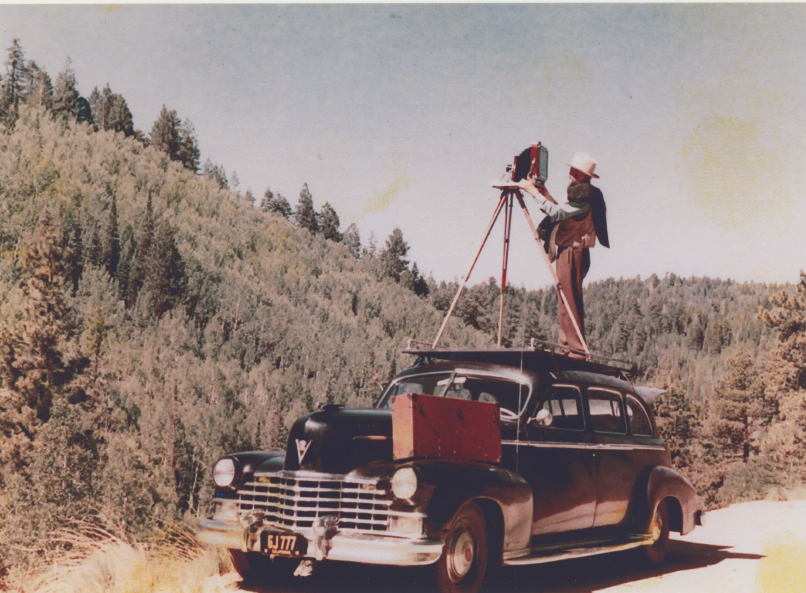
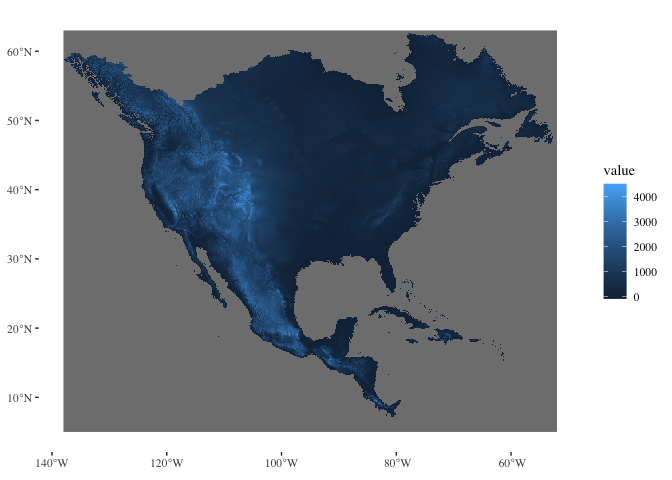
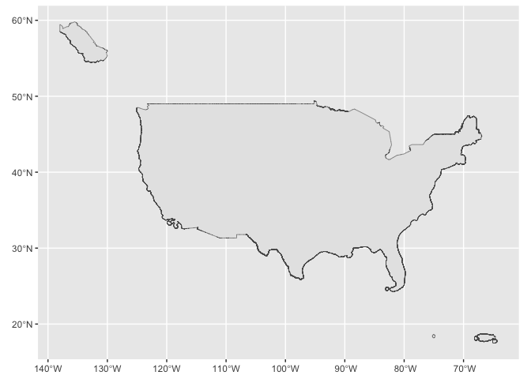
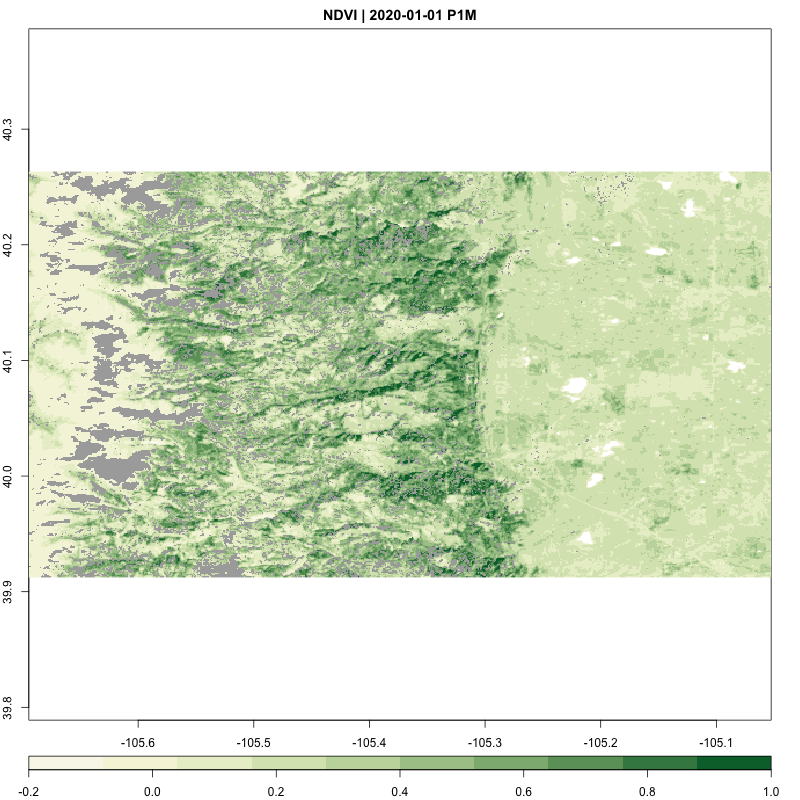

STAC_mount_save
================
Ty Tuff, ESIIL Data Scientist
2023-10-27

## ‘To Make’ or ‘To Take’ a photo

The distinction between making and taking a photograph lies in the
approach and intent behind the camera. Taking a photo is often a
reactive process, where the photographer captures moments as they
naturally unfold, seizing the spontaneity of life without alteration.
It’s a passive form of photography where the emphasis is on the right
timing and the natural interplay of elements within the frame. On the
other hand, making a photo is a proactive and deliberate act. It is akin
to craftsmanship, where a professional photographer starts with a
concept and utilizes a variety of tools and techniques to stage and
construct the desired scene. They actively manipulate lighting,
composition, and subjects to create a photograph that aligns with their
pre-visualized artistic vision. While both methods use a camera to
produce a photograph, making a photo involves a creation process,
whereas taking a photo is about finding the scene.

David Yarrow is a famous photographer who ‘makes’ his photographs.


## What does it mean to ‘make’ a data cube?

The artistry of Ansel Adams’ photography serves as a compelling analogy
for the meticulous craft of building a data cube from cloud data sources
using tools like STAC and GDAL VSI. Just as Adams would survey the
vastness of a landscape, discerning the interplay of light and shadow
upon the mountains before him, a data architect surveys the expanse of
available data. In this analogy, the raw data are the majestic mountains
and sweeping landscapes waiting to be captured. The STAC collection acts
as the photographer’s deliberate choice of scene, pointing the camera
lens—our data tools—towards the most telling and coherent dataset.

 Just as Adams’
photographs are more than mere records of a landscape, but rather a
confluence of his vision, technique, and the scene’s natural beauty, so
too is the data cube more than the sum of its parts. It is the artful
synthesis of information, crafted and composed with the skill and intent
of an artist, producing not just a tool for analysis but a harmonized,
data-driven portrait of the world it represents. The builder of the data
cube is, indeed, an artist, and the data cube their masterpiece,
revealing not just data, but a story, a perspective, a landscape sewn
from the raw material of cloud-sourced information.

As Adams would adjust his viewfinder, setting the boundaries of his
photographic frame, the data builder sets the view window, filtering and
transferring relevant data to their own medium, akin to Adams’ film.
This is where the raw data is transformed, organized into the structured
form of a data frame or data cube, a process not unlike the careful
development of a photograph in a darkroom. Here, the data cube creator,
much like Adams with his careful dodging and burning, harmonizes
disparate elements into a cohesive whole, each decision reflecting an
intention and vision for the final product.

``` r

#library(Rcpp)
library(sf)
library(gdalcubes)
library(rstac)
library(gdalUtils)
library(terra)
library(rgdal)
library(reshape2)
library(osmdata)
library(terra)
library(dplyr)
library(stars)
library(ggplot2)
library(colorspace)
library(geos)
library(osmdata)
library(ggthemes)
library(tidyr)
gdalcubes_options(parallel = 8)

sf::sf_extSoftVersion()
##           GEOS           GDAL         proj.4 GDAL_with_GEOS     USE_PROJ_H 
##       "3.11.0"        "3.5.3"        "9.1.0"         "true"         "true" 
##           PROJ 
##        "9.1.0"
gdalcubes_gdal_has_geos()
## [1] TRUE

library(osmdata)
library(dplyr)
library(sf)
library(terra)
library(tidyterra)
library(glue)
library(ggplot2)
library(ggthemes)
library(stars)
library(magrittr)
```

## 1) The Rat through the Snake Problem: Scalability with Cloud Computing

Just like a snake that swallows a rat, traditional computing systems
often struggle to process the large volumes of environmental data —
they’re constrained by their static hardware limitations. Cloud
computing introduces a python-esque capability: massive scalability. By
migrating to the cloud, we essentially make the snake bigger, allowing
it to handle larger “prey.” Scalable computers in the cloud can grow
with the demand, providing the necessary computational power to process
extensive datasets, which is vital in a field where data volumes are
increasing exponentially.


## 2) The Antelope through the Python Problem: Streamlining with GDAL VSI

As we scale up, we encounter a new challenge: trying to pass an antelope
through a python — a metaphor for the next level of complexity in data
processing. The sheer size and complexity of the data can become
overwhelming. This is where GDAL’s Virtual File System (VSI) becomes our
ecological adaptation. VSI allows us to access remote data transparently
and more efficiently. Instead of ingesting the entire “antelope,” VSI
enables the “python” to dynamically access and process only the parts of
the data it needs, when it needs them, much like constriction before
digestion. This selective access minimizes the need for local storage
and expedites the data handling process.


### Mounting data

A void-filled Digital Elevation Model (DEM) is a comprehensive
topographical representation where any missing data points, known as
voids, have been filled in. These voids can occur due to various
reasons, such as clouds or technical errors during data collection. In a
void-filled DEM, these gaps are interpolated or estimated using the
surrounding data to create a continuous, seamless surface model. This
process enhances the utility and accuracy of the DEM for hydrological
modeling, terrain analysis, and other geographical applications. The
HydroSHEDS website
(https://www.hydrosheds.org/hydrosheds-core-downloads) provides access
to high-quality, void-filled DEM datasets like the
DEM_continuous_CONUS_15s, which users can download and easily integrate
into spatial analysis workflows using tools such as ‘terra’ in R,
allowing for sophisticated environmental and geographical research and
planning.

``` r
# Record start time
a <- Sys.time()  

# Create a string with the file path using glue, then download and read the DEM file as a raster object

DEM_continuous_CONUS_15s <- glue(
  "/vsizip/vsicurl/", #magic remote connection 
  "https://data.hydrosheds.org/file/hydrosheds-v1-dem/hyd_na_dem_15s.zip", #copied link to download location
  "/hyd_na_dem_15s.tif") %>% #path inside zip file
  terra::rast()  

# The 'glue' function constructs the file path string, which is then passed to 'terra::rast()' to read the DEM file into R as a raster layer. '/vsizip/vsicurl/' is a special GDAL virtual file system syntax that allows reading directly from a zipped file on a remote server.

# Record end time and calculate the time difference
b <- Sys.time()  
difftime(b, a) 
```

    Time difference of 0.5191751 secs

``` r
# The resulting raster object is stored in 'DEM_continuous_CONUS_15s', which now contains the void-filled DEM data ready for use

DEM_continuous_CONUS_15s  # Prints out the details of the 'DEM_continuous_CONUS_15s' raster object
```

    class       : SpatRaster 
    dimensions  : 13920, 20640, 1  (nrow, ncol, nlyr)
    resolution  : 0.004166667, 0.004166667  (x, y)
    extent      : -138, -52, 5, 63  (xmin, xmax, ymin, ymax)
    coord. ref. : lon/lat WGS 84 (EPSG:4326) 
    source      : hyd_na_dem_15s.tif 
    name        : Band_1 

``` r
# output is a SpatRaster, which is the object type associated with the 'terra' package. 
```

``` r
# Record start time
a <- Sys.time()

ggplot() +
  geom_spatraster(data=DEM_continuous_CONUS_15s) +
  theme_tufte()
```



``` r
b <- Sys.time()
difftime(b, a)
```

    Time difference of 1.060889 mins

``` r
# Transform the filtered geometry to EPSG:4326 and store its bounding box
# Record start time
a <- Sys.time()

DEM_continuous_CONUS_15s |>
stars::st_as_stars() |> 
  st_transform("EPSG:4326") |>
  st_bbox() -> bbox_4326


DEM_continuous_CONUS_15s |>
stars::st_as_stars() |> 
  st_transform("EPSG:32618") |>
  st_bbox() -> bbox_32618

b <- Sys.time()
difftime(b, a)
```

    Time difference of 3.909238 mins

``` r
boulder_county <- getbb("boulder, co", format_out="sf_polygon")

boulder_county$multipolygon |> 
  st_transform(crs =4326 ) |>
  st_bbox() -> bbox_4326_boulder

boulder_county$multipolygon |> 
  st_transform(crs =32720 ) |>
  st_bbox() -> bbox_32720_boulder
```

``` r
aoi <- getbb("United States", format_out="sf_polygon")

conus <- aoi$multipolygon |>
  st_crop(bbox_4326)


ggplot(data=conus) +
  geom_sf()
```



``` r
 stac("https://earth-search.aws.element84.com/v1") |>
       get_request()
```

    ###STACCatalog
    - id: earth-search-aws
    - description: A STAC API of public datasets on AWS
    - field(s): stac_version, type, id, title, description, links, conformsTo

``` r
collection_formats()
```

       CHIRPS_v2_0_daily_p05_tif | Image collection format for CHIRPS v 2.0 daily
                                 | global precipitation dataset (0.05 degrees
                                 | resolution) from GeoTIFFs, expects list of .tif
                                 | or .tif.gz files as input. [TAGS: CHIRPS,
                                 | precipitation]
     CHIRPS_v2_0_monthly_p05_tif | Image collection format for CHIRPS v 2.0 monthly
                                 | global precipitation dataset (0.05 degrees
                                 | resolution) from GeoTIFFs, expects list of .tif
                                 | or .tif.gz files as input. [TAGS: CHIRPS,
                                 | precipitation]
               ESA_CCI_SM_ACTIVE | Collection format for ESA CCI soil moisture
                                 | active product (version 4.7) [TAGS: Soil
                                 | Moisture, ESA, CCI]
              ESA_CCI_SM_PASSIVE | Collection format for ESA CCI soil moisture
                                 | passive product (version 4.7) [TAGS: Soil
                                 | Moisture, ESA, CCI]
       GPM_IMERG_3B_DAY_GIS_V06A | Collection format for daily
                                 | IMERG_3B_DAY_GIS_V06A data [TAGS: Precipitation,
                                 | GPM, IMERG]
                         L8_L1TP | Collection format for Landsat 8 Level 1 TP
                                 | product [TAGS: Landsat, USGS, Level 1, NASA]
                           L8_SR | Collection format for Landsat 8 surface
                                 | reflectance product [TAGS: Landsat, USGS, Level
                                 | 2, NASA, surface reflectance]
                           MAXAR | Preliminary collection format for MAXAR open
                                 | data, visual only (under development) [TAGS: ]
                         MxD09GA | Collection format for selected bands from the
                                 | MODIS MxD09GA (Aqua and Terra) product [TAGS:
                                 | MODIS, surface reflectance]
                         MxD10A2 | Collection format for selected bands from the
                                 | MODIS MxD10A2 (Aqua and Terra) v006 Snow Cover
                                 | product [TAGS: MODIS, Snow Cover]
                         MxD11A1 | Collection format for selected bands from the
                                 | MODIS MxD11A2 (Aqua and Terra) v006 Land Surface
                                 | Temperature product [TAGS: MODIS, LST]
                         MxD11A2 | Collection format for selected bands from the
                                 | MODIS MxD11A2 (Aqua and Terra) v006 Land Surface
                                 | Temperature product [TAGS: MODIS, LST]
                         MxD13A2 | Collection format for selected bands from the
                                 | MODIS MxD13A2 (Aqua and Terra) product [TAGS:
                                 | MODIS, VI, NDVI, EVI]
                         MxD13A3 | Collection format for selected bands from the
                                 | MODIS MxD13A3 (Aqua and Terra) product [TAGS:
                                 | MODIS, VI, NDVI, EVI]
                         MxD13Q1 | Collection format for selected bands from the
                                 | MODIS MxD13Q1 (Aqua and Terra) product [TAGS:
                                 | MODIS, VI, NDVI, EVI]
                         MxD14A2 | Collection format for the MODIS MxD14A2 (Aqua
                                 | and Terra) product [TAGS: MODIS, Fire]
    PlanetScope_3B_AnalyticMS_SR | Image collection format for PlanetScope 4-band
                                 | scenes [TAGS: PlanetScope, BOA, Surface
                                 | Reflectance]
                   Sentinel2_L1C | Image collection format for Sentinel 2 Level 1C
                                 | data as downloaded from the Copernicus Open
                                 | Access Hub, expects a list of file paths as
                                 | input. The format works on original ZIP
                                 | compressed as well as uncompressed imagery.
                                 | [TAGS: Sentinel, Copernicus, ESA, TOA]
               Sentinel2_L1C_AWS | Image collection format for Sentinel 2 Level 1C
                                 | data in AWS [TAGS: Sentinel, Copernicus, ESA,
                                 | TOA]
                   Sentinel2_L2A | Image collection format for Sentinel 2 Level 2A
                                 | data as downloaded from the Copernicus Open
                                 | Access Hub, expects a list of file paths as
                                 | input. The format should work on original ZIP
                                 | compressed as well as uncompressed imagery.
                                 | [TAGS: Sentinel, Copernicus, ESA, BOA, Surface
                                 | Reflectance]
             Sentinel2_L2A_THEIA | Image collection format for Sentinel 2 Level 2A
                                 | data as downloaded from Theia. [TAGS: Sentinel,
                                 | ESA, Flat Reflectance, Theia]


``` r
# Record start time
a <- Sys.time()

# Initialize STAC connection
s = stac("https://earth-search.aws.element84.com/v0")


# Search for Sentinel-2 images within specified bounding box and date range
#22 Million items
items = s |>
    stac_search(collections = "sentinel-s2-l2a-cogs",
                bbox = c(bbox_4326_boulder["xmin"], 
                         bbox_4326_boulder["ymin"],
                         bbox_4326_boulder["xmax"], 
                         bbox_4326_boulder["ymax"]), 
                datetime = "2021-05-15/2021-05-16") |>
    post_request() |>
    items_fetch(progress = FALSE)

# Print number of found items
length(items$features)
```

    [1] 1

``` r
# Prepare the assets for analysis
library(gdalcubes)
assets = c("B01", "B02", "B03", "B04", "B05", "B06", 
           "B07", 
           "B08", "B8A", "B09", "B11", "B12", "SCL")
s2_collection = stac_image_collection(items$features, asset_names = assets,
property_filter = function(x) {x[["eo:cloud_cover"]] < 20}) #all images with less than 20% clouds

b <- Sys.time()
difftime(b, a)
```

    Time difference of 1.507489 secs

``` r
# Display the image collection
s2_collection
```

    Image collection object, referencing 1 images with 13 bands
    Images:
                          name      left      top   bottom     right
    1 S2B_13TDE_20210516_0_L2A -106.1832 40.65079 39.65576 -104.8846
                 datetime        srs
    1 2021-05-16T18:02:54 EPSG:32613

    Bands:
       name offset scale unit nodata image_count
    1   B01      0     1                       1
    2   B02      0     1                       1
    3   B03      0     1                       1
    4   B04      0     1                       1
    5   B05      0     1                       1
    6   B06      0     1                       1
    7   B07      0     1                       1
    8   B08      0     1                       1
    9   B09      0     1                       1
    10  B11      0     1                       1
    11  B12      0     1                       1
    12  B8A      0     1                       1
    13  SCL      0     1                       1


``` r
# Record start time
a <- Sys.time()

# Define a specific view on the satellite image collection
v = cube_view(
    srs = "EPSG:32720", #this is harder than expected. 
    dx = 100, 
    dy = 100, 
    dt = "P1M", 
    aggregation = "median", 
    resampling = "near",
    extent = list(
        t0 = "2021-05-15", 
        t1 = "2021-05-16",
        left = bbox_32720_boulder[1], 
        right = bbox_32720_boulder[2],
        top = bbox_32720_boulder[4], 
        bottom = bbox_32720_boulder[3]
    )
)

b <- Sys.time()
difftime(b, a)
```

    Time difference of 0.003129005 secs

``` r
# Display the defined view
v
```

    A data cube view object

    Dimensions:
                    low             high  count pixel_size
    t        2021-05-01       2021-05-31      1        P1M
    y -3103099.52398788 15434400.4760121 185375        100
    x -3178878.98542359 15369521.0145764 185484        100

    SRS: "EPSG:32720"
    Temporal aggregation method: "median"
    Spatial resampling method: "near"

``` r
# Record start time
a <- Sys.time()


x <- s2_collection |>
    raster_cube(v) |>
    select_bands(c("B01", "B02", "B03", "B04", 
                   "B05", "B06", "B07", "B08", 
                   "B8A", "B09", "B11", "B12")) |>
    extract_geom(boulder_county$multipolygon) |>
    rename(
        "time" = "time",
        "443" = "B01",
        "490" = "B02",
        "560" = "B03",
        "665" = "B04",
        "705" = "B05",
        "740" = "B06",
        "783" = "B07",
        "842" = "B08",
        "865" = "B8A",
        "940" = "B09",
        "1610" = "B11",
        "2190" = "B12"
    )

b <- Sys.time()
difftime(b, a)
```

    Time difference of 1.283643 mins

``` r
head(x)
```

      FID       time   443   490   560   665   705   740   783   842  865  940 1610
    1   1 2021-05-01 11096 10929 10224  9893  9956  9706  9715  9641 9511 8459 5682
    2   1 2021-05-01 11631 11282 10550 10234 10288 10031 10032  9988 9828 9153 5802
    3   1 2021-05-01 11900 11393 10666 10337 10398 10142 10138 10093 9927 9461 5754
    4   1 2021-05-01 11406 10597  9928  9626  9694  9481  9516  9338 9336 8959 5726
    5   1 2021-05-01 11399 10939 10237  9905  9978  9738  9746  9633 9555 8925 5831
    6   1 2021-05-01 11600 11174 10462 10147 10209  9952  9960  9890 9760 9153 5773
      2190
    1 3917
    2 3981
    3 3937
    4 4054
    5 4097
    6 3990

``` r
# Record start time
a <- Sys.time()

s2_collection |>
    raster_cube(v) |>
    select_bands(c( "B04", "B05"))  |>
  apply_pixel(c("(B05-B04)/(B05+B04)"), names="NDVI") |>
  write_tif() |>
  raster::stack() -> x
x
```

    class      : RasterStack 
    dimensions : 185375, 185484, 34384096500, 1  (nrow, ncol, ncell, nlayers)
    resolution : 100, 100  (x, y)
    extent     : -3178879, 15369521, -3103100, 15434400  (xmin, xmax, ymin, ymax)
    crs        : +proj=utm +zone=20 +south +datum=WGS84 +units=m +no_defs 
    names      : NDVI 

``` r
b <- Sys.time()
difftime(b, a)
```

    Time difference of 4.065354 mins

``` r
# Record start time
a <- Sys.time()

s2_collection |>
    raster_cube(v) |>
    select_bands(c("B04","B05"))  |>
  apply_pixel(c("(B05-B04)/(B05+B04)"), names="NDVI") |>
  stars::st_as_stars() -> y

b <- Sys.time()
difftime(b, a)
```

    Time difference of 1.414532 mins

``` r
y
```

    stars_proxy object with 1 attribute in 1 file(s):
    $NDVI
    [1] "[...]/filebf1e3968299a.nc:NDVI"

    dimension(s):
         from     to   offset delta                refsys point
    x       1 185484 -3178879   100 WGS 84 / UTM zone 20S    NA
    y       1 185375 15434400  -100 WGS 84 / UTM zone 20S    NA
    time    1      1       NA    NA               POSIXct FALSE
                          values x/y
    x                       NULL [x]
    y                       NULL [y]
    time [2021-05-01,2021-06-01)    

``` r
# Record start time
a <- Sys.time()

items <- s |>
    stac_search(collections = "sentinel-s2-l2a-cogs",
                bbox = c(-105.694362,   39.912886,  -105.052774,    40.262785),
                datetime = "2020-01-01/2022-12-31",
                limit = 500) %>% 
    post_request() 

S2.mask = image_mask("SCL", values=c(3,8,9))

col = stac_image_collection(items$features, asset_names = assets, 
                            property_filter = function(x) {x[["eo:cloud_cover"]] < 30})

v = cube_view(srs = "EPSG:4326",  extent = list(t0 = "2020-01-01", t1 = "2022-12-31",
              left = -105.694362, right = -105.052774,  top = 40.262785, bottom = 39.912886),
              dx = 0.001, dy = 0.001, dt = "P1M", aggregation = "median", resampling = "bilinear")

library(colorspace)
ndvi.col = function(n) {
  rev(sequential_hcl(n, "Green-Yellow"))
}
library(gdalcubes)
raster_cube(col, v, mask = S2.mask) |>
    select_bands(c("B04", "B08")) |>
    apply_pixel("(B08-B04)/(B08+B04)", "NDVI") |>
    gdalcubes::animate(col = ndvi.col, zlim=c(-0.2,1), key.pos = 1, save_as = "anim.gif", fps = 4)
```

    [1] "/Users/ty/Documents/Github/hackathon2023_datacube/docs/code_for_building_cube/anim.gif"

``` r
b <- Sys.time()
difftime(b, a)
```

    Time difference of 4.954337 mins

``` r
y
```

    stars_proxy object with 1 attribute in 1 file(s):
    $NDVI
    [1] "[...]/filebf1e3968299a.nc:NDVI"

    dimension(s):
         from     to   offset delta                refsys point
    x       1 185484 -3178879   100 WGS 84 / UTM zone 20S    NA
    y       1 185375 15434400  -100 WGS 84 / UTM zone 20S    NA
    time    1      1       NA    NA               POSIXct FALSE
                          values x/y
    x                       NULL [x]
    y                       NULL [y]
    time [2021-05-01,2021-06-01)    



``` r
items_2020 <- s |>
    stac_search(collections = "sentinel-s2-l2a-cogs",
                bbox = c(-105.694362,   39.912886,  -105.052774,    40.262785),
                datetime = "2020-05-01/2020-06-30") |> 
    post_request() 

items_2021 <- s |>
    stac_search(collections = "sentinel-s2-l2a-cogs",
                bbox = c(-105.694362,   39.912886,  -105.052774,    40.262785),
                datetime = "2021-05-01/2021-06-30") |> 
    post_request() 


col_2020 = stac_image_collection(items_2020$features, asset_names = assets)
col_2021 = stac_image_collection(items_2021$features, asset_names = assets)

v_2020 = cube_view(srs = "EPSG:32720",  extent = list(t0 = "2020-05-01", t1 = "2020-06-30",
              left = bbox_32720_boulder["xmin"], right = bbox_32720_boulder["xmax"],  top = bbox_32720_boulder["ymax"], bottom = bbox_32720_boulder["ymin"]),
              dx = 100, dy = 100, dt = "P1D", aggregation = "median", resampling = "bilinear")

v_2021 = cube_view(v_2020, extent = list(t0 = "2021-05-01", t1 = "2021-06-30"))


max_ndvi_mosaic <- function(col, v) {
    raster_cube(col, v) |>
    select_bands(c("B04", "B08")) |>
    apply_pixel(c("(B08-B04)/(B08+B04)"), names="NDVI") |>
    reduce_time("max(NDVI)")
}

suppressPackageStartupMessages(library(stars))
max_ndvi_mosaic(col_2020, v_2020) -> maxndvi_2020

max_ndvi_mosaic(col_2021, v_2021)  -> maxndvi_2021

maxndvi_2021
maxndvi_2020

difference = maxndvi_2021 - maxndvi_2020
difference[difference > -0.15] = NA
names(difference) <- "Difference of max NDVI (2020 - 2019)"
```

``` r
flood_polygon_data3 <- glue("/vsizip/vsicurl/https://data.hydrosheds.org/file/hydrosheds-associated/gloric/GloRiC_v10_shapefile.zip/GloRiC_v10_shapefile/GloRiC_v10.shp") |>
  st_read() |>
  st_as_sf(coords = c("lon","lat"))

flood_polygon_data3
```

``` r
#st_read("/Users/ty/Downloads/GloRiC_v10_geodatabase/GloRiC_v10.gdb")

flood_polygon_data3 <- glue("/vsizip/vsicurl/https://data.hydrosheds.org/file/hydrosheds-associated/gloric/GloRiC_v10_geodatabase.zip/GloRiC_v10_geodatabase/GloRiC_v10.gdb") |>
  st_read() |>
  st_as_sf(coords = c("lon","lat"))

flood_polygon_data3
```
