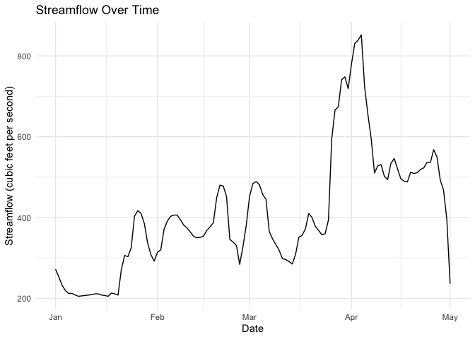

USGS Water Services
================
Ty Tuff, ESIIL Data Scientist
2023-10-30

The United States Geological Survey (USGS) delivers a suite of robust
and comprehensive APIs to facilitate the exploration and analysis of
water data. Offering real-time and historical information on parameters
such as streamflow, groundwater levels, and water quality measurements,
these APIs are critical for a wide array of stakeholders, including
researchers, policymakers, environmentalists, and many others.

In the upcoming example, we will tap into this invaluable resource,
specifically focusing on real-time streamflow data for a designated
site. By accessing the USGS APIs, we will retrieve and subsequently
chart the streamflow data, offering a clear, visual representation of
this critical water measurement.

This exercise serves as not only a practical guide to interacting with
USGS water data APIs but also as an introduction to the vast
possibilities these data sources present. Whether it’s tracking
environmental changes, informing water policy, or guiding scientific
research, the data accessible through the USGS APIs provides an
indispensable foundation for a multitude of analyses.

R Code:

``` r
# Load the required libraries
library(dataRetrieval)
library(ggplot2)

# Define the USGS site number for a specific location
site <- "06759500" # Changed to a different site number

# Define the parameter code for streamflow
parameterCd <- "00060"

# Specify the start and end dates for data retrieval
startDate <- "2023-01-01"
endDate <- "2023-05-01"

# Retrieve daily streamflow data for the specified site and date range
data <- readNWISdv(siteNumbers = site, parameterCd = parameterCd, startDate = startDate, endDate = endDate)

if (nrow(data) > 0) {
  # Convert the data to a data frame
  df <- data.frame(Date = as.Date(data$Date),
                   Streamflow = data$X_00060_00003)
  
  # Plot the data
  ggplot(df, aes(x = Date, y = Streamflow)) +
    geom_line() +
    theme_minimal() +
    labs(title = "Streamflow Over Time",
         x = "Date",
         y = "Streamflow (cubic feet per second)")
} else {
  cat("No data available for the specified site and date range.\n")
}
```



``` python
import requests
import pandas as pd
import matplotlib.pyplot as plt
from datetime import datetime

# Define the USGS site number for a specific location
site = "06759500"  # Changed to a different site number

# Define the parameter code for streamflow
parameterCd = "00060"

# Specify the start and end dates for data retrieval
startDate = "2023-01-01"
endDate = "2023-05-01"

# Build the URL
url = f"https://waterservices.usgs.gov/nwis/dv/?format=json&sites={site}&startDT={startDate}&endDT={endDate}&parameterCd={parameterCd}"

# Send the request
response = requests.get(url)

# Parse the JSON response
data = response.json()

# Extract the time series data
time_series = data["value"]["timeSeries"]

# Check if there is data
if time_series:
    # Extract the values and dates
    values = [
        float(item["value"]) for item in time_series[0]["values"][0]["value"]
    ]
    dates = [
        datetime.strptime(item["dateTime"], "%Y-%m-%dT%H:%M:%S.%f")
        for item in time_series[0]["values"][0]["value"]
    ]
    
    # Create a data frame
    df = pd.DataFrame({"Date": dates, "Streamflow": values})

    # Plot the data
    df.plot(x="Date", y="Streamflow")
    plt.title("Streamflow Over Time")
    plt.ylabel("Streamflow (cubic feet per second)")
    plt.grid(True)
    plt.show()
```


